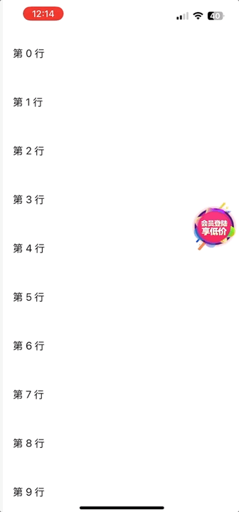

# FHXFloatingButton(浮动登录按键)

## ✨ Features

该按键提供多个外部属性进行设置：

1. 点击按键回调
2. 自定义图片
3. 设置按键大小
4. 边界限制
5. 滑动 ScrollerView (TableView, CollectionView) 隐藏按钮动画时间
6. 拖拽吸边动画时间（透传给按钮）
7. 滚动时自动隐藏

## 📸 Preview

<p align="center">
  
</p>

## 🚀 Usage

登录浮动按键,app未登录状态下能够显示在控制器的一侧,点击登录按键跳转登录页面,滑动屏幕登录按键动画方式隐藏

## 📦 Installation 


```objc
pod 'FHXFloatingButton', '~> 0.1.0'
```

## Use

```objc
    FHXFloatingManager *manager = [FHXFloatingManager shared];
    /// 图片（推荐用 name）
    manager.imageName = @"loginBtn";
    /// 按钮大小
    manager.size = CGSizeMake(85, 85);
    /// 边界限制（替代 top/bottom）
    manager.edgeInset = UIEdgeInsetsMake(100, 10, 100, 10);
    /// 滚动时自动隐藏
    manager.autoHideWhenScroll = YES;
    /// 默认动画时间
    manager.dragAnimationDuration = 0.5;
    /// 拖拽吸边动画时间（透传给按钮）
    manager.moveAnimationDuration = 0.25;
    /// 点击回调
    manager.clickBlock = ^{
        NSLog(@"点击悬浮按钮");
    };

    [manager show];
```

## Demol

```objc
#import "ViewController.h"
#import "FHXFloatingManager.h"

@interface ViewController () <UITableViewDataSource,UITableViewDelegate>

@property (nonatomic,strong) UITableView *tableview;

@end

@implementation ViewController

- (void)viewDidLoad {
    [super viewDidLoad];
    self.view.backgroundColor = [UIColor whiteColor];
    
    FHXFloatingManager *manager = [FHXFloatingManager shared];
    /// 图片（推荐用 name）
    manager.imageName = @"loginBtn";
    /// 按钮大小
    manager.size = CGSizeMake(85, 85);
    /// 边界限制（替代 top/bottom）
    manager.edgeInset = UIEdgeInsetsMake(100, 10, 100, 10);
    /// 滚动时自动隐藏
    manager.autoHideWhenScroll = YES;
    /// 默认动画时间
    manager.dragAnimationDuration = 0.5;
    /// 拖拽吸边动画时间（透传给按钮）
    manager.moveAnimationDuration = 0.25;
    /// 点击回调
    manager.clickBlock = ^{
        NSLog(@"点击悬浮按钮");
    };

    [manager show];
    
    self.view.backgroundColor = [UIColor whiteColor];
    self.tableview = [[UITableView alloc] init];
    self.tableview.addTo(self.view);
    self.tableview.delegate = self;
    self.tableview.dataSource =self;
    self.tableview.backgroundColor = [UIColor whiteColor];
    self.tableview.showsVerticalScrollIndicator = NO;
    self.tableview.showsHorizontalScrollIndicator = NO;
    self.tableview.separatorStyle = UITableViewCellSeparatorStyleNone;
    self.tableview.tableFooterView = [[UIView alloc] init];
    self.tableview.rowHeight = 80;
    [self.tableview registerClass:[UITableViewCell class] forCellReuseIdentifier:@"CellIdentifier"];
    self.tableview.tableHeaderView = [[UIView alloc] initWithFrame:CGRectMake(0, 0, 0, CGFLOAT_MIN)];
    self.tableview.tableFooterView = [[UIView alloc] initWithFrame:CGRectMake(0, 0, 0, CGFLOAT_MIN)];
    self.tableview.sectionHeaderHeight = CGFLOAT_MIN;
    self.tableview.sectionFooterHeight = CGFLOAT_MIN;
    self.tableview.estimatedRowHeight = 0;
    self.tableview.estimatedSectionHeaderHeight = 0;
    self.tableview.estimatedSectionFooterHeight = 0;
    self.tableview.makeCons(^{
        make.left.right.equal.view(self.view);
        make.top.equal.view(self.view);
        make.bottom.equal.view(self.view);
    });

}


-(NSInteger)tableView:(UITableView *)tableView numberOfRowsInSection:(NSInteger)section {
    return 20;
}

- (UITableViewCell *)tableView:(UITableView *)tableView cellForRowAtIndexPath:(NSIndexPath *)indexPath
{
    static NSString *cellID = @"CellIdentifier";

    UITableViewCell *cell = [tableView dequeueReusableCellWithIdentifier:cellID];
    
    if (!cell) {

        cell = [[UITableViewCell alloc] initWithStyle:UITableViewCellStyleDefault
                                       reuseIdentifier:cellID];
    }
    
    // 设置内容
    cell.textLabel.text = [NSString stringWithFormat:@"第 %ld 行", (long)indexPath.row];
    
    return cell;
}

- (void)scrollViewWillBeginDragging:(UIScrollView *)scrollView {
    [[NSNotificationCenter defaultCenter] postNotificationName:@"FHXScrollBegin" object:nil];
}

- (void)scrollViewDidEndDecelerating:(UIScrollView *)scrollView {
    [[NSNotificationCenter defaultCenter] postNotificationName:@"FHXScrollEnd" object:nil];
}

@end
```
